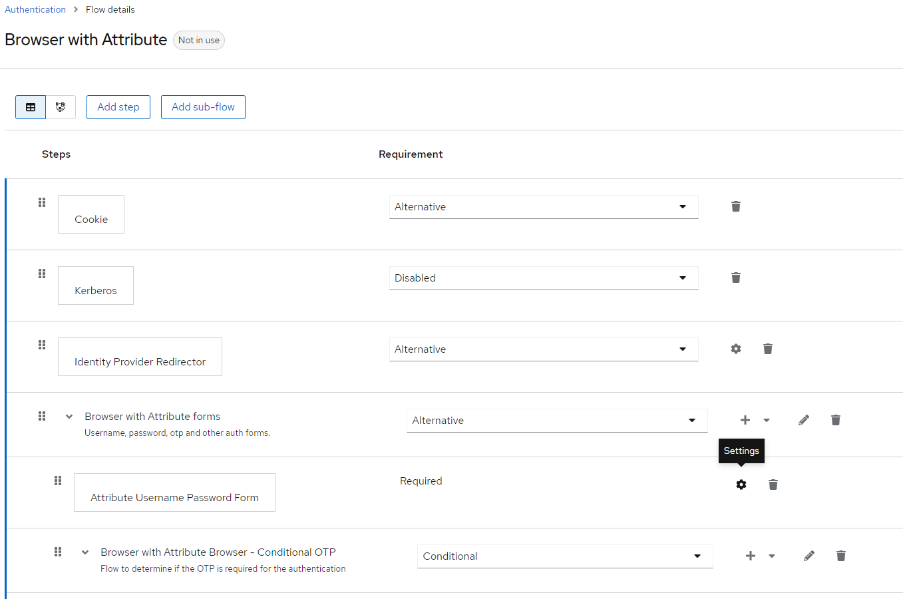
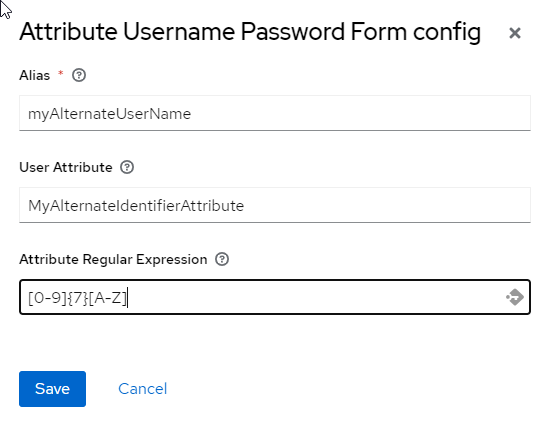
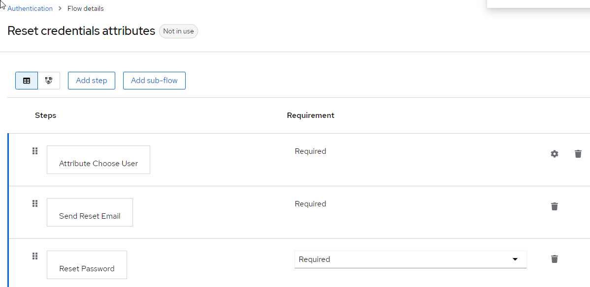

# Keycloak Login Attribute SPI

An [Authentication Service Provider](https://www.keycloak.org/docs/latest/server_development/index.html#_auth_spi) that adds the possibility for [Keycloak](https://www.keycloak.org) to connect via a user attribute.

## Use Case

If the username entered in the form
* does not match a primary identifier
* does not match email (if this option is enabled for realm)
* respect the desired regular expression

Then the search by attribute is activated
* if this search returns a single user, password verification is activated

## Installation

Just drop the jar into the _deployments_ subdirectory of your Keycloak installation
or use the jboss-cli deploy command.

## Configuration

Make sure that you have correctly configured an attribute for your users which can be used as an identifier alternative.

Switch to your realm in the keycloak administration console. 

Switch to the "Authentication" configuration and copy the original browser flow, 
giving the copy it a reasonable name,
maybe "Browser with Attribute".

Then replace the "Username Password Form" execution by the new "Attribute Username Password Form" execution.

Configure this new step with your attribute name and choose a regex which can restrict calls and avoid expensives searches by attribute.

Having done so you have to select your copy of the browser in the bindings tab for the browser flow.

# Keycloak Reset Credential Attribute

Like the Keycloak Login Attribute SPI, AttributeChooseUser adds the possibility for [Keycloak](https://www.keycloak.org) to reset credentials via a user attribute.

## Configuration

Make sure that you have correctly configured an attribute for your users which can be used as an identifier alternative.

Switch to your realm in the keycloak administration console. 

Switch to the "Authentication" configuration and copy the original reset credential flow, giving the copy it a reasonable name, maybe "Reset Credential with Attribute".

Then replace the "Choose User" execution by the new "Attribute Choose User" execution.

Configure this new step with your attribute name and choose a regex which can restrict calls and avoid expensives searches by attribute.

Having done so you have to select your copy of the browser in the bindings tab for the browser flow.

## License

 See [LICENSE file](./LICENSE)
